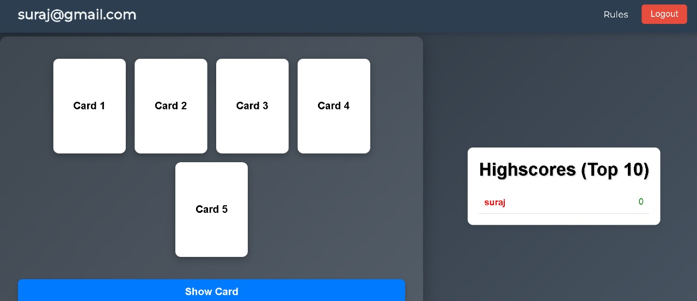
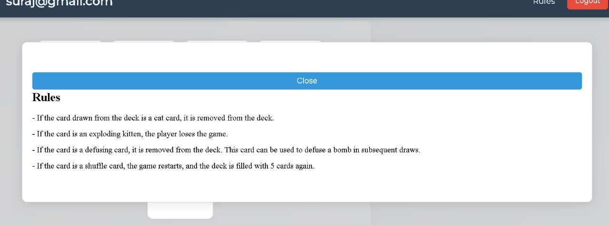
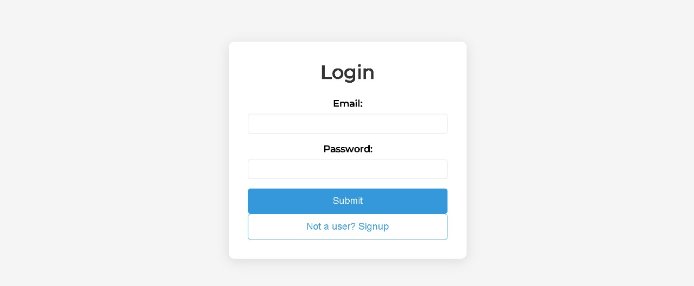
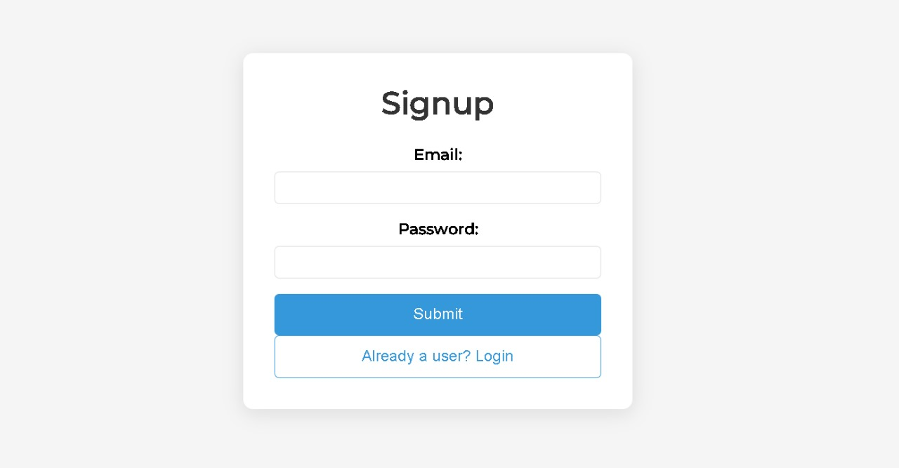

# Exploding Kitten - Full Stack Application

This project was built by @shaansuraj as an assignment for Emitrr's recruitment. Please do not copy this project.



## Table of Contents
1. [Project Overview](#project-overview)
2. [Features](#features)
3. [Technologies Used](#technologies-used)
4. [Frontend Setup](#frontend-setup)
   - [Installation](#installation)
   - [Running the Frontend](#running-the-frontend)
5. [Backend Setup](#backend-setup)
   - [Installation](#backend-installation)
   - [Running the Backend](#running-the-backend)
6. [Folder Structure](#folder-structure)
7. [Screenshots](#screenshots)


## Project Overview

**Exploding Kitten** is a web-based single-player card game where players draw cards from a deck. The game consists of four types of cards: Cat, Defuse, Shuffle, and Exploding Kitten. The player wins if they can successfully draw all the cards without drawing the Exploding Kitten card.

### Game Rules:
- **Cat Card**: Safe to draw.
- **Defuse Card**: Can be used to defuse the Exploding Kitten card.
- **Shuffle Card**: Shuffles the deck and resets the game.
- **Exploding Kitten**: Ends the game if drawn unless the player has a defuse card.

The application also includes features like a leaderboard to track players' scores, real-time updates, and game persistence to allow users to continue from where they left off.

## Features

- **Single-player gameplay** with deck management.
- **Real-time leaderboard** using Redis.
- **Game persistence** so users can continue their game after leaving.
- **Authentication** for users to sign up and log in to save their scores.
- **Responsive design** using React.

## Technologies Used

### Frontend:
- React, Redux
- Vite (Build Tool)
- CSS for styling
- React Router for navigation

### Backend:
- Golang (Server logic)
- Redis (Database for leaderboard and game persistence)
- JWT for authentication
- Express (API layer)

---

## Frontend Setup

### Installation

1. Clone the repository:
   ```bash
   git clone https://github.com/shaansuraj/exploding-kitten-emitrr.git
   cd exploding-kitten-emitrr/client

2. Install Dependencies
    ```bash
    npm install

### Running the Frontend
1. Run the Development Server:
    ```bash
    npm run build

2. Open your browser and navigate to http://localhost:5173 to view the application.

## Backend Setup

### Installation

1. Navigate to the backend directory:
   ```bash
   cd exploding-kitten-emitrr/server

2. Install Dependencies
    ```bash
    npm install

3. Create a .env file in the server directory and add your environment variables:
    ```bash
    PORT=5000
    USER=your_redis_user
    PASS=your_redis_password
    URL=your_redis_url
    SECRET=your_jwt_secret

### Running the Frontend
1. Start the Backend Server:
    ```bash
    npm run start

2. The server will run on http://localhost:8000.

## Folder Structure
    ```
    └── 📁exploding_kitten_emitrr
    └── 📁assets
        └── login.jpg
        └── main.jpg
        └── rules.jpg
        └── signup.jpg
    └── 📁client
        └── 📁public
        └── 📁src
            └── 📁components
            └── 📁redux
            └── App.jsx
            └── Board.jsx
            └── index.css
            └── main.jsx
    └── 📁server
        └── 📁src
            └── 📁controllers
            └── 📁middleware
            └── 📁routes
            └── 📁schema
            └── redisClient.ts
        └── server.ts
    ```
    

## Screenshots
 
 
 


